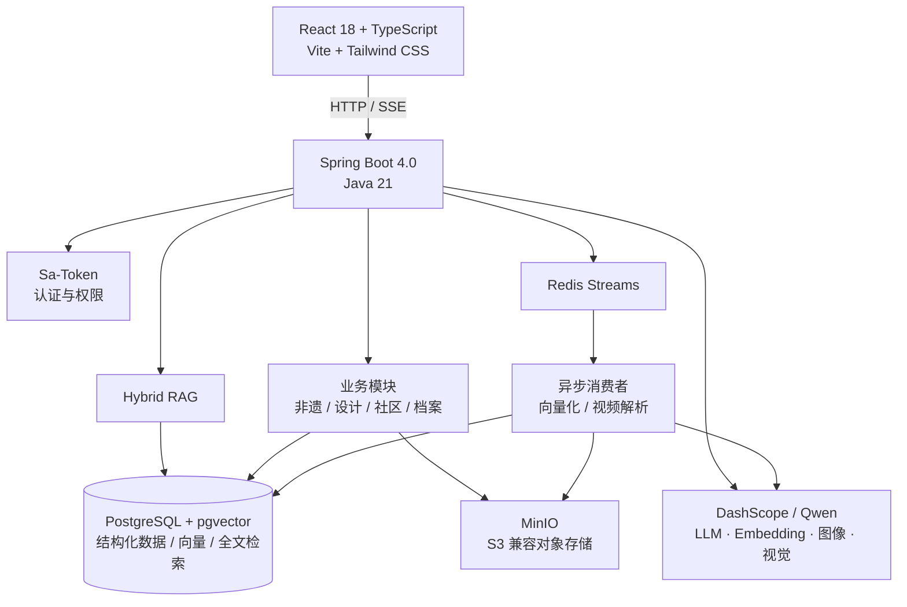
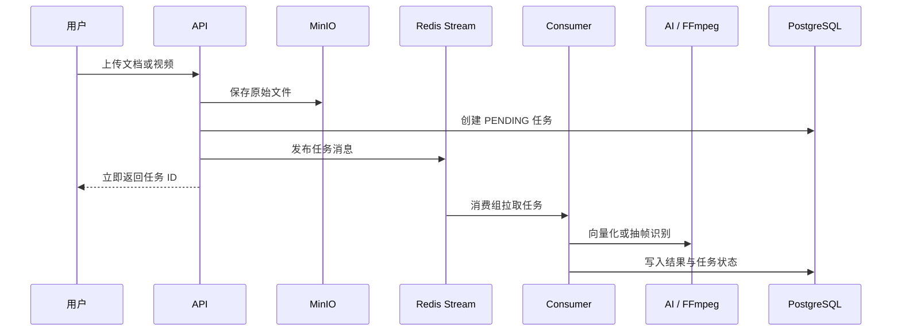
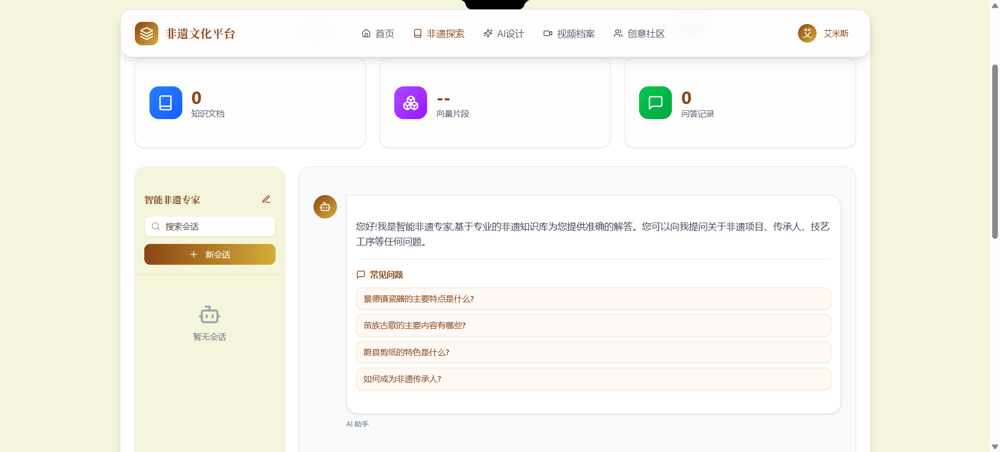
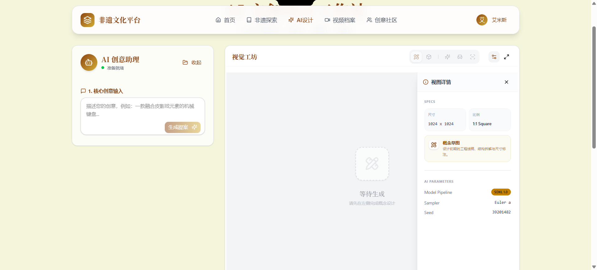
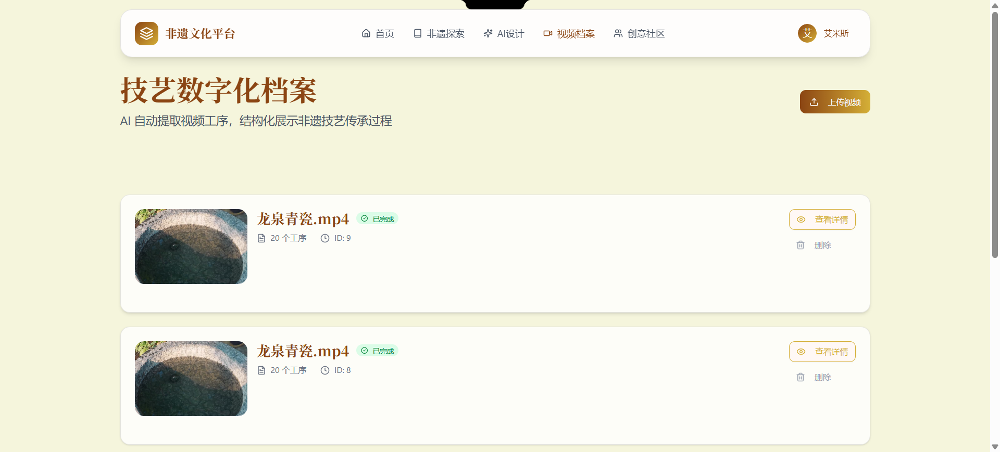
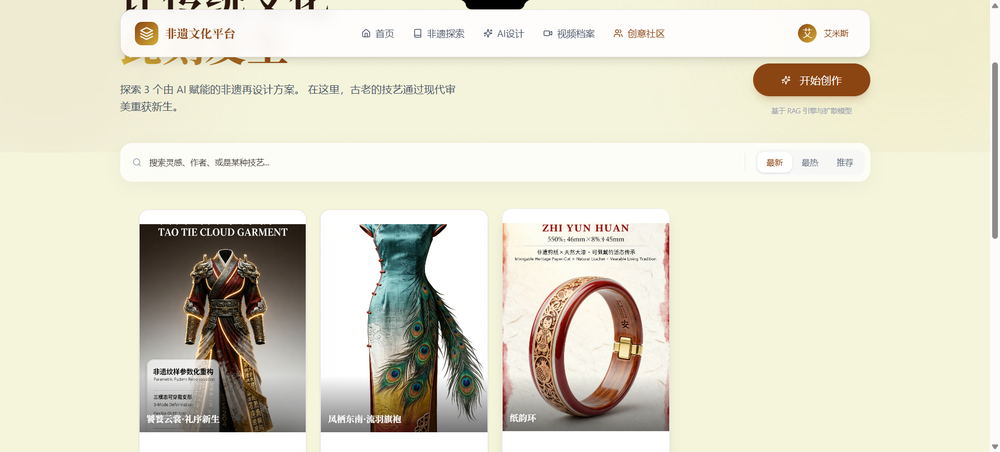
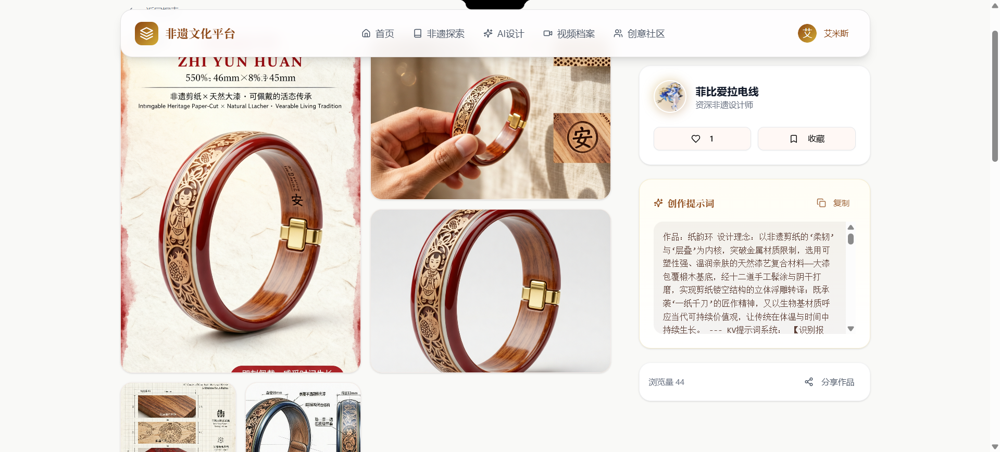

# 非遗文化智能创意生成平台

<p align="center">
  面向非物质文化遗产保护、创意设计与数字化传播的全栈 AI 应用。
</p>

<p align="center">
  <a href="#核心能力">核心能力</a> ·
  <a href="#系统架构">系统架构</a> ·
  <a href="#界面预览">界面预览</a> ·
  <a href="#快速开始">快速开始</a>
</p>

<p align="center">
  
  
  
  
  
  
</p>

## 项目简介

平台将非遗知识问答、AI 文创设计、工艺视频归档与创意社区整合为一条完整链路。用户可在知识库中获得带来源的问答结果，基于非遗元素生成文创设计方案，将工艺视频解析为可检索的步骤档案，并在社区中发布、浏览和二次创作作品。

## 核心能力

- **Hybrid RAG 问答**：将 pgvector 语义召回与 PostgreSQL 全文关键词召回融合，使用 RRF 重排上下文；支持文档上传、异步向量化、知识来源追溯与 SSE 流式回复。
- **AI 文创设计**：覆盖设计概念、工程草图、产品效果图、KV 物料及市场/技术/风险分析，并支持导出 PDF 设计提案。
- **工艺数字化档案**：视频上传后由 Redis Streams 异步处理，通过 FFmpeg 抽帧和视觉模型识别生成“关键帧 + 工序说明 + 时间码”的结构化档案。
- **创意分享社区**：支持作品发布、瀑布流展示、提示词 Remix、点赞、收藏与评论互动。
- **管理后台**：提供用户、非遗项目与传承人、知识库及社区内容的管理能力，并通过 Sa-Token 进行权限控制。

## 系统架构



### 异步任务流



## 技术栈

| 层级 | 技术 |
| --- | --- |
| 前端 | React 18、TypeScript、Vite、Tailwind CSS、React Router、Framer Motion、ApexCharts / Recharts |
| 后端 | Java 21、Spring Boot 4.0、Spring AI、Spring Data JPA、Sa-Token、MapStruct |
| 数据与检索 | PostgreSQL 16、pgvector、HNSW、余弦距离、PostgreSQL Full-Text Search、RRF |
| 异步与存储 | Redis 7 Streams、Redisson、MinIO（S3 兼容） |
| AI 与多媒体 | DashScope / Qwen、text-embedding-v3、Qwen-VL-Max、qwen-image-max、wan2.6-image、FFmpeg |
| 工程化 | Gradle、Docker Compose、Nginx、iText 8、Apache Tika |

## 界面预览

### 智能非遗专家



### AI 文创设计工作站



### 技艺数字化档案



### 创意分享社区



### 作品详情与 Remix 信息



## 快速开始

### 前置条件

- Docker Desktop（推荐）
- 或 Java 21、Node.js 20+、PostgreSQL 16（含 pgvector）、Redis 7、MinIO
- 阿里云百炼 API Key

### Docker Compose 启动

1. 在项目根目录创建 `.env`：

   ```env
   AI_BAILIAN_API_KEY=your_api_key
   # AI_MODEL=qwen3.5-plus
   ```

2. 启动全部服务：

   ```bash
   docker compose up -d --build
   ```

3. 打开服务：

   | 服务 | 地址 |
   | --- | --- |
   | 前端 | http://localhost |
   | 后端 API | http://localhost:8080 |
   | 健康检查 | http://localhost:8080/actuator/health |
   | MinIO Console | http://localhost:9001 |

### 本地开发

先启动基础设施：

```bash
docker compose -f docker-compose.infrastructure.yml up -d
```

在两个终端分别运行：

```bash
# 后端
set AI_BAILIAN_API_KEY=your_api_key
gradlew.bat :app:bootRun

# 前端
cd frontend
npm install
npm run dev
```

开发环境前端默认运行在 `http://localhost:5173`。

## 目录结构

```text
.
├── app/                         # Spring Boot 后端
│   └── src/main/java/heritage/gen/
│       ├── modules/             # user / heritage / knowledgebase / design / archive / community
│       ├── infrastructure/      # Redis、文件存储等基础设施
│       └── common/              # 配置、异常、鉴权、通用响应
├── frontend/                    # React 前端
│   └── src/
│       ├── pages/               # 页面
│       ├── components/          # UI 与业务组件
│       └── api/                 # 后端 API 客户端
├── docker/                      # 容器初始化配置
├── docs/images/                 # README 截图
└── docker-compose.yml
```

## 质量检查

```bash
# 后端测试
gradlew.bat :app:test

# 前端构建
cd frontend
npm run build
```

## 安全说明

- 不要提交 `.env`、API Key、访问令牌或生产数据库凭据。
- 生产环境请收紧 CORS 来源、替换默认的对象存储凭据，并在入口层配置 HTTPS 与速率限制。

## License

本项目采用 [Apache License 2.0](LICENSE) 开源协议。
