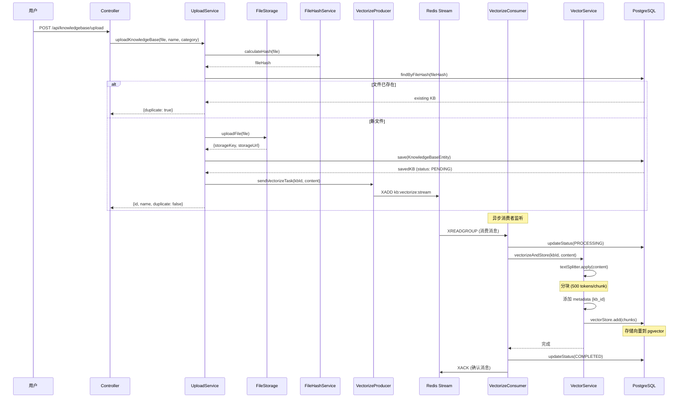
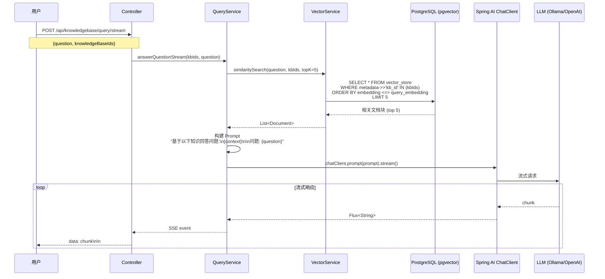
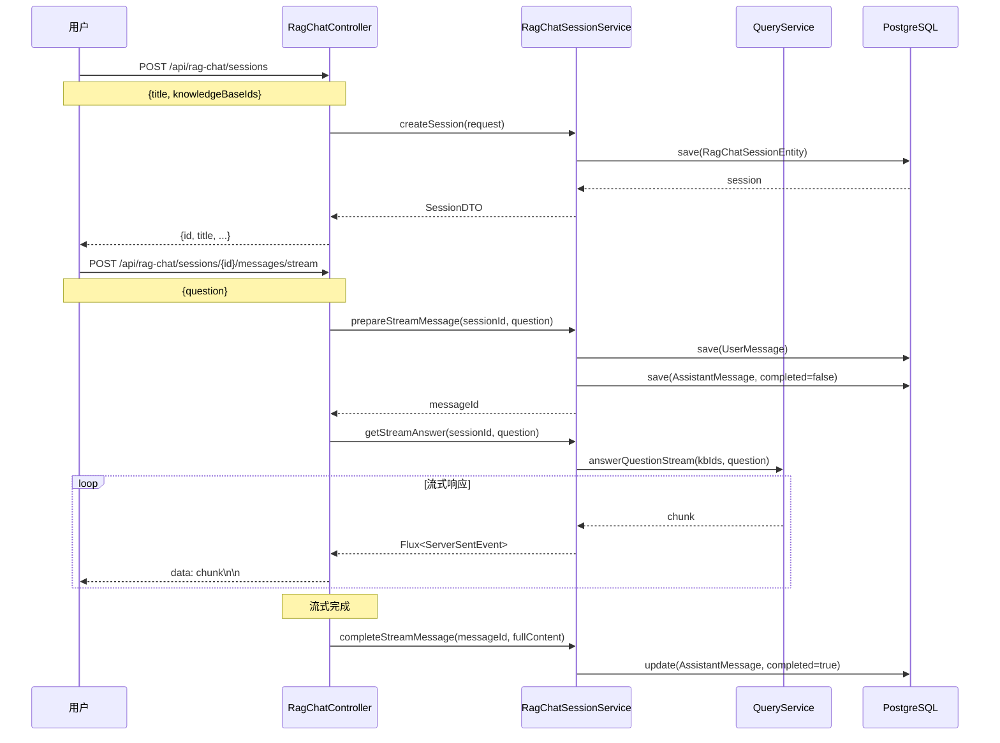

# 知识库与 RAG 系统架构分析

## 📋 概述

这是一个基于 **Spring AI** 构建的企业级 RAG (Retrieval-Augmented Generation) 知识库系统,支持文档上传、向量化、智能检索和流式对话。

---

## 🏗️ 技术栈

### 核心框架
- **Spring Boot 4.0** + **Java 21**
- **Spring AI 2.0** - AI 应用开发框架
- **PostgreSQL 14+** + **pgvector** - 向量数据库
- **Redis 6+** - 消息队列 (Stream) 和缓存
- **Apache Tika 2.9.2** - 文档解析

### AI 能力
- **向量化**: Spring AI 的 Embedding 模型
- **文本分块**: `TokenTextSplitter` (500 tokens/chunk, 50 tokens overlap)
- **向量存储**: `PgVectorStore` (PostgreSQL + pgvector)
- **LLM 对话**: OpenAI 兼容模式 (支持本地 Ollama)

---

## 📁 模块结构

```
knowledgebase/
├── KnowledgeBaseController.java      # 知识库管理 API
├── RagChatController.java            # RAG 聊天 API
├── listener/                          # 消息队列
│   ├── VectorizeStreamProducer.java  # 向量化任务生产者
│   └── VectorizeStreamConsumer.java  # 向量化任务消费者
├── model/                             # 数据模型
│   ├── KnowledgeBaseEntity.java      # 知识库实体
│   ├── RagChatSessionEntity.java     # 聊天会话实体
│   ├── RagChatMessageEntity.java     # 聊天消息实体
│   ├── VectorStatus.java             # 向量化状态枚举
│   └── DTO/                           # 数据传输对象
├── repository/                        # 数据访问层
│   ├── KnowledgeBaseRepository.java  # 知识库仓库
│   ├── VectorRepository.java         # 向量数据仓库
│   ├── RagChatSessionRepository.java # 会话仓库
│   └── RagChatMessageRepository.java # 消息仓库
└── service/                           # 业务逻辑层
    ├── KnowledgeBaseUploadService.java    # 文件上传服务
    ├── KnowledgeBaseVectorService.java    # 向量化服务
    ├── KnowledgeBaseQueryService.java     # 知识库查询服务
    ├── KnowledgeBaseListService.java      # 列表管理服务
    ├── KnowledgeBaseDeleteService.java    # 删除服务
    ├── KnowledgeBaseParseService.java     # 文档解析服务
    └── RagChatSessionService.java         # RAG 聊天会话服务
```

---

## 🔄 核心流程

### 1. 知识库上传与向量化流程



**关键设计**:
- ✅ **文件去重**: 基于 SHA-256 哈希值避免重复上传
- ✅ **异步向量化**: 使用 Redis Stream 解耦上传和向量化
- ✅ **状态跟踪**: `PENDING` → `PROCESSING` → `COMPLETED` / `FAILED`
- ✅ **重试机制**: 最多重试 3 次,失败后标记错误信息
- ✅ **元数据标记**: 每个向量块携带 `kb_id` 用于检索过滤

---

### 2. RAG 查询流程 (流式)



**关键设计**:
- ✅ **向量相似度检索**: 使用 pgvector 的 `<=>` 运算符计算余弦相似度
- ✅ **多知识库支持**: 通过 `metadata.kb_id` 过滤指定知识库
- ✅ **流式响应**: 使用 SSE (Server-Sent Events) 实现打字机效果
- ✅ **上下文注入**: 将检索到的文档作为上下文传递给 LLM

---

### 3. RAG 聊天会话流程



**关键设计**:
- ✅ **会话管理**: 支持多轮对话,保存完整历史
- ✅ **消息占位**: 先创建空消息,流式完成后更新内容
- ✅ **知识库绑定**: 每个会话关联特定知识库集合
- ✅ **置顶功能**: 支持会话置顶和标题自定义

---

## 💾 数据模型

### 知识库实体 (`KnowledgeBaseEntity`)

| 字段 | 类型 | 说明 |
|------|------|------|
| [id](file:///c:/Users/DELL/Desktop/heritage-culture/frontend/src/types/index.ts#93-105) | Long | 主键 |
| [name](file:///c:/Users/DELL/Desktop/heritage-culture/app/src/main/java/heritage/gen/modules/knowledgebase/service/KnowledgeBaseUploadService.java#167-180) | String | 知识库名称 |
| `originalFilename` | String | 原始文件名 |
| `fileHash` | String | SHA-256 哈希值 (唯一索引) |
| `fileSize` | Long | 文件大小 (字节) |
| `contentType` | String | MIME 类型 |
| `storageKey` | String | RustFS 存储键 |
| `storageUrl` | String | RustFS 访问 URL |
| `category` | String | 分类 (可选) |
| `vectorStatus` | VectorStatus | 向量化状态 |
| `vectorError` | String | 错误信息 (失败时) |
| `chunkCount` | Integer | 分块数量 |
| `uploadedAt` | LocalDateTime | 上传时间 |
| `lastAccessedAt` | LocalDateTime | 最后访问时间 |
| `accessCount` | Integer | 访问次数 |

### 向量化状态 ([VectorStatus](file:///c:/Users/DELL/Desktop/heritage-culture/app/src/main/java/heritage/gen/modules/knowledgebase/listener/VectorizeStreamConsumer.java#187-202))

```java
public enum VectorStatus {
    PENDING,     // 待处理
    PROCESSING,  // 处理中
    COMPLETED,   // 完成
    FAILED       // 失败
}
```

### RAG 聊天会话 (`RagChatSessionEntity`)

| 字段 | 类型 | 说明 |
|------|------|------|
| [id](file:///c:/Users/DELL/Desktop/heritage-culture/frontend/src/types/index.ts#93-105) | Long | 主键 |
| `title` | String | 会话标题 |
| `knowledgeBases` | Set<KnowledgeBaseEntity> | 关联知识库 (多对多) |
| `isPinned` | Boolean | 是否置顶 |
| `messageCount` | Integer | 消息数量 |
| `createdAt` | LocalDateTime | 创建时间 |
| `updatedAt` | LocalDateTime | 更新时间 |

### RAG 聊天消息 (`RagChatMessageEntity`)

| 字段 | 类型 | 说明 |
|------|------|------|
| [id](file:///c:/Users/DELL/Desktop/heritage-culture/frontend/src/types/index.ts#93-105) | Long | 主键 |
| `session` | RagChatSessionEntity | 所属会话 |
| `type` | MessageType | 消息类型 (USER/ASSISTANT) |
| `content` | String | 消息内容 |
| `messageOrder` | Integer | 消息顺序 |
| `completed` | Boolean | 是否完成 (流式) |
| `createdAt` | LocalDateTime | 创建时间 |

---

## 🎯 设计亮点

### 1. 异步向量化架构

**问题**: 向量化是 CPU/GPU 密集型操作,同步处理会阻塞用户请求

**解决方案**: 使用 **Redis Stream** 实现生产者-消费者模式

- **生产者** ([VectorizeStreamProducer](file:///c:/Users/DELL/Desktop/heritage-culture/app/src/main/java/heritage/gen/modules/knowledgebase/listener/VectorizeStreamProducer.java#17-64)): 上传完成后立即发送任务到 Stream
- **消费者** ([VectorizeStreamConsumer](file:///c:/Users/DELL/Desktop/heritage-culture/app/src/main/java/heritage/gen/modules/knowledgebase/listener/VectorizeStreamConsumer.java#25-211)): 后台线程持续消费任务
- **优势**:
  - ✅ 用户上传后立即返回,无需等待向量化完成
  - ✅ 支持水平扩展 (多实例消费者)
  - ✅ 自动重试机制 (最多 3 次)
  - ✅ 消息持久化,服务重启不丢失任务

### 2. 文件去重机制

**实现**: 基于 SHA-256 哈希值

```java
String fileHash = fileHashService.calculateHash(file);
Optional<KnowledgeBaseEntity> existing = repository.findByFileHash(fileHash);
if (existing.isPresent()) {
    // 更新访问计数,返回 duplicate: true
    return handleDuplicateKnowledgeBase(existing.get(), fileHash);
}
```

**优势**:
- ✅ 节省存储空间
- ✅ 避免重复向量化计算
- ✅ 保留访问统计

### 3. 向量检索优化

**元数据过滤**: 每个向量块携带 `kb_id` 元数据

```java
chunks.forEach(chunk -> chunk.getMetadata().put("kb_id", knowledgeBaseId.toString()));
```

**查询时过滤**:

```java
allResults.stream()
    .filter(doc -> {
        Long kbIdLong = Long.parseLong(doc.getMetadata().get("kb_id").toString());
        return knowledgeBaseIds.contains(kbIdLong);
    })
    .limit(topK)
```

**优势**:
- ✅ 支持多知识库联合检索
- ✅ 精确控制检索范围
- ✅ 避免跨知识库污染

### 4. 流式响应设计

**RAG 聊天流式流程**:

1. **预保存**: 先保存用户消息和空的 AI 消息占位
2. **流式生成**: 返回 `Flux<ServerSentEvent<String>>`
3. **完成回调**: 流式结束后更新 AI 消息内容

```java
return sessionService.getStreamAnswer(sessionId, question)
    .doOnNext(fullContent::append)
    .map(chunk -> ServerSentEvent.<String>builder()
        .data(chunk.replace("\n", "\\n"))  // 转义换行符
        .build())
    .doOnComplete(() -> {
        sessionService.completeStreamMessage(messageId, fullContent.toString());
    });
```

**优势**:
- ✅ 实时显示生成进度 (打字机效果)
- ✅ 降低首字延迟 (TTFB)
- ✅ 即使中断也能保存已生成内容

### 5. 服务层职责分离

**单一职责原则**: 每个 Service 专注一个领域

- [KnowledgeBaseUploadService](file:///c:/Users/DELL/Desktop/heritage-culture/app/src/main/java/heritage/gen/modules/knowledgebase/service/KnowledgeBaseUploadService.java#26-211) - 文件上传和元数据保存
- [KnowledgeBaseVectorService](file:///c:/Users/DELL/Desktop/heritage-culture/app/src/main/java/heritage/gen/modules/knowledgebase/service/KnowledgeBaseVectorService.java#19-137) - 向量化和检索
- `KnowledgeBaseQueryService` - RAG 查询和回答生成
- `KnowledgeBaseListService` - 列表查询和统计
- `KnowledgeBaseDeleteService` - 删除和清理
- [RagChatSessionService](file:///c:/Users/DELL/Desktop/heritage-culture/app/src/main/java/heritage/gen/modules/knowledgebase/service/RagChatSessionService.java#28-221) - 聊天会话管理

**优势**:
- ✅ 代码清晰易维护
- ✅ 便于单元测试
- ✅ 支持独立扩展

---

## 📊 API 接口总览

### 知识库管理 API

| 方法 | 路径 | 说明 |
|------|------|------|
| POST | `/api/knowledgebase/upload` | 上传知识库文件 |
| GET | `/api/knowledgebase/list` | 获取知识库列表 |
| GET | `/api/knowledgebase/{id}` | 获取知识库详情 |
| DELETE | `/api/knowledgebase/{id}` | 删除知识库 |
| GET | `/api/knowledgebase/{id}/download` | 下载知识库文件 |
| POST | `/api/knowledgebase/query` | RAG 查询 (同步) |
| POST | `/api/knowledgebase/query/stream` | RAG 查询 (流式 SSE) |
| GET | `/api/knowledgebase/categories` | 获取所有分类 |
| PUT | `/api/knowledgebase/{id}/category` | 更新分类 |
| GET | `/api/knowledgebase/search` | 搜索知识库 |
| GET | `/api/knowledgebase/stats` | 获取统计信息 |
| POST | `/api/knowledgebase/{id}/revectorize` | 重新向量化 |

### RAG 聊天 API

| 方法 | 路径 | 说明 |
|------|------|------|
| POST | `/api/rag-chat/sessions` | 创建会话 |
| GET | `/api/rag-chat/sessions` | 获取会话列表 |
| GET | `/api/rag-chat/sessions/{id}` | 获取会话详情 |
| PUT | `/api/rag-chat/sessions/{id}/title` | 更新会话标题 |
| PUT | `/api/rag-chat/sessions/{id}/pin` | 切换置顶状态 |
| PUT | `/api/rag-chat/sessions/{id}/knowledge-bases` | 更新关联知识库 |
| DELETE | `/api/rag-chat/sessions/{id}` | 删除会话 |
| POST | `/api/rag-chat/sessions/{id}/messages/stream` | 发送消息 (流式 SSE) |

---

## 🔧 技术细节

### 文本分块策略

```java
private final TextSplitter textSplitter = new TokenTextSplitter();
// 默认配置:
// - chunkSize: 500 tokens
// - chunkOverlap: 50 tokens
```

**为什么选择 500 tokens?**
- ✅ 平衡上下文完整性和检索精度
- ✅ 适配大多数 LLM 的上下文窗口
- ✅ 避免单个 chunk 过大导致噪音

### 向量相似度计算

PostgreSQL + pgvector 使用 **余弦相似度**:

```sql
SELECT * FROM vector_store
WHERE metadata->>'kb_id' = '123'
ORDER BY embedding <=> query_embedding
LIMIT 5;
```

`<=>` 运算符: 计算两个向量的余弦距离 (越小越相似)

### Redis Stream 配置

```java
public static final String KB_VECTORIZE_STREAM_KEY = "kb:vectorize:stream";
public static final String KB_VECTORIZE_GROUP_NAME = "kb-vectorize-group";
public static final int BATCH_SIZE = 10;
public static final int POLL_INTERVAL_MS = 1000;
public static final int MAX_RETRY_COUNT = 3;
```

---

## 🚀 性能优化建议

### 1. 向量检索优化

**当前**: 先检索所有向量,再通过 metadata 过滤

**优化**: 使用 pgvector 的 WHERE 子句直接过滤

```sql
-- 优化前 (应用层过滤)
SELECT * FROM vector_store ORDER BY embedding <=> query LIMIT 100;
-- 然后在 Java 中过滤 kb_id

-- 优化后 (数据库层过滤)
SELECT * FROM vector_store
WHERE metadata->>'kb_id' IN ('1', '2', '3')
ORDER BY embedding <=> query
LIMIT 5;
```

### 2. 缓存热门查询

使用 Redis 缓存高频问题的检索结果:

```java
@Cacheable(value = "rag:query", key = "#question + ':' + #kbIds")
public List<Document> similaritySearch(String question, List<Long> kbIds) {
    // ...
}
```

### 3. 批量向量化

当前是逐个文件向量化,可以改为批量处理:

```java
// 从 Stream 批量读取 10 条消息
List<Map<String, String>> batch = redisService.streamReadBatch(10);
// 批量向量化
vectorService.batchVectorize(batch);
```

---

## 📝 总结

这是一个**架构清晰、设计优雅**的 RAG 知识库系统:

✅ **异步解耦**: Redis Stream 实现上传和向量化分离  
✅ **流式体验**: SSE 流式响应提升用户体验  
✅ **多知识库**: 支持联合检索和会话绑定  
✅ **状态跟踪**: 完整的向量化状态管理  
✅ **文件去重**: 基于哈希值避免重复存储  
✅ **服务分层**: 单一职责,易于维护和扩展  

**适用场景**: 企业知识库、文档问答、客服机器人、智能助手等

**扩展方向**:
- 支持更多文档格式 (Excel, PPT, 图片 OCR)
- 实现混合检索 (向量 + 关键词)
- 添加权限控制 (知识库访问权限)
- 支持多模态 RAG (图文混合)
